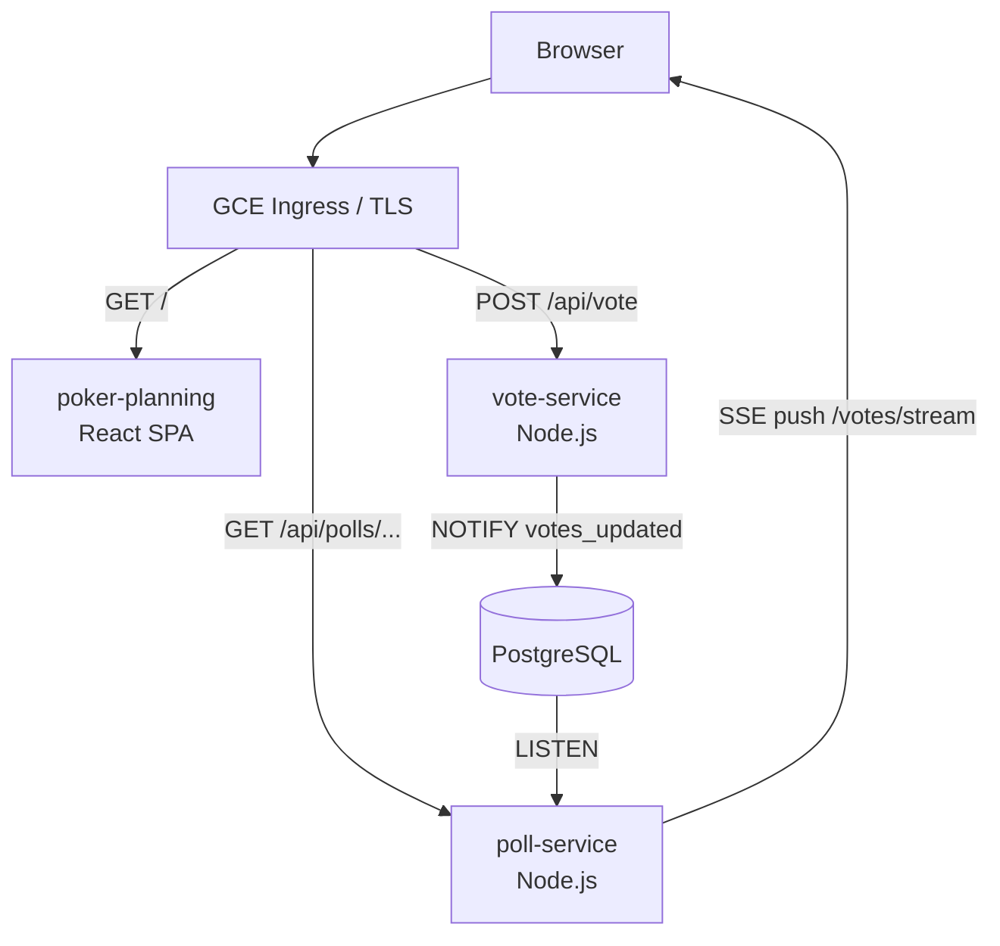

# Planning Poker - Real-Time Estimation App

A collaborative planning poker web application for agile teams, deployed on GKE with real-time vote updates powered by **Server-Sent Events (SSE)** and **PostgreSQL LISTEN/NOTIFY**.

## Demo

If the links do not work, the videos can also be found in the docs/ folder.


https://github.com/user-attachments/assets/405c8fc1-0981-4552-b02b-6242170320b7


https://github.com/user-attachments/assets/638f7d58-dedb-4421-bb9d-1ea22b3f4708


https://github.com/user-attachments/assets/8ab766f9-3cac-4c6f-9865-497cc2cef383


## Architecture

More details in docs/report.md


### Services

| Service          | Description                      | Replicas |
| ---------------- | -------------------------------- | -------- |
| `poker-planning` | React 19 + Vite frontend (Nginx) | 1        |
| `poll-service`   | REST API + SSE endpoint          | 2        |
| `vote-service`   | Vote submission API              | 2        |
| `postgres`       | PostgreSQL 13 (StatefulSet)      | 1        |

### Real-Time Flow

1. A user submits a vote → `vote-service` upserts the row and runs `NOTIFY votes_updated, '<pollId>'`
2. `poll-service` has a dedicated PostgreSQL client running `LISTEN votes_updated`
3. On notification, `poll-service` fetches the updated vote list and streams it to all connected SSE clients for that poll
4. The React frontend uses the `EventSource` API and re-renders on each event

This replaces the previous HTTP polling approach and removes unnecessary load on the database.

## Tech Stack

- **Frontend:** React 19, Vite, TailwindCSS, Radix UI, React Router
- **Backend:** Node.js, Express 5
- **Database:** PostgreSQL 13
- **Orchestration:** Kubernetes (GKE)
- **Ingress:** GCE Load Balancer + cert-manager (Let's Encrypt DNS-01 via Cloudflare)
- **Registry:** Google Artifact Registry

## Local Development

### Prerequisites

- Node.js 18+
- Docker
- PostgreSQL running locally (or via Docker)

### Run services locally

```bash
# Start PostgreSQL
docker run -d \
  -e POSTGRES_USER=admin \
  -e POSTGRES_PASSWORD=yourpassword \
  -e POSTGRES_DB=polldb \
  -p 5432:5432 postgres:13-alpine

# Poll service + React frontend (concurrently)
cd live-poll-app
npm install
npm run dev        # runs nodemon server.js + React dev server in parallel

# Or run them separately:
npm run server     # nodemon server.js only
npm run client     # React dev server only

# Vote service
cd live-poll-app/vote-service
npm install
PGUSER=admin PGPASSWORD=yourpassword PGHOST=localhost PGDATABASE=polldb PGPORT=5432 node server.js
```

## GKE Deployment

### 1. Configure image references

In each deployment yaml, replace the image placeholders with your registry:

```yaml
# live-poll-app/poll-deployment.yaml
# live-poll-app/vote-deployment.yaml
# live-poll-app/poker-planning-deployment.yaml
image: <YOUR_REGISTRY_HOST>/<YOUR_GCP_PROJECT_ID>/poker-repo/<service>:latest
```

Example for Google Artifact Registry:

```
europe-west1-docker.pkg.dev/my-project-id/poker-repo/poll-service:latest
```

### 2. Configure domain and TLS

In `live-poll-app/poll-ingress.yaml`, replace `<YOUR_DOMAIN>` with your domain.

In `live-poll-app/clusterissuer.yaml`, update the email and Cloudflare API token secret.

### 3. Build and push images

```bash
docker build -t <YOUR_REGISTRY_HOST>/<YOUR_GCP_PROJECT_ID>/poker-repo/poll-service:latest live-poll-app/
docker build -t <YOUR_REGISTRY_HOST>/<YOUR_GCP_PROJECT_ID>/poker-repo/vote-service:latest live-poll-app/vote-service/
docker build -t <YOUR_REGISTRY_HOST>/<YOUR_GCP_PROJECT_ID>/poker-repo/poker-planning:latest live-poll-app/poker-planning/
docker push <YOUR_REGISTRY_HOST>/<YOUR_GCP_PROJECT_ID>/poker-repo/poll-service:latest
docker push <YOUR_REGISTRY_HOST>/<YOUR_GCP_PROJECT_ID>/poker-repo/vote-service:latest
docker push <YOUR_REGISTRY_HOST>/<YOUR_GCP_PROJECT_ID>/poker-repo/poker-planning:latest
```

### 4. Create the PostgreSQL secret

Before applying any manifest, create the secret that pods reference for the database password:

```bash
kubectl create secret generic postgres-secret \
  --from-literal=POSTGRES_PASSWORD=yourpassword
```

### 5. Apply manifests

```bash
kubectl apply -f live-poll-app/postgres-deployment.yaml
kubectl apply -f live-poll-app/poll-deployment.yaml
kubectl apply -f live-poll-app/poll-service.yaml
kubectl apply -f live-poll-app/vote-deployment.yaml
kubectl apply -f live-poll-app/vote-service.yaml
kubectl apply -f live-poll-app/poker-planning-deployment.yaml
kubectl apply -f live-poll-app/backend-config.yaml
kubectl apply -f live-poll-app/clusterissuer.yaml
kubectl apply -f live-poll-app/poll-ingress.yaml
```

### GCP notes

- Services use `cloud.google.com/neg: '{"ingress": true}'` for container-native load balancing
- `backend-config.yaml` sets a **3600s timeout** on API services - required to keep SSE connections alive through the GCP load balancer
- TLS certificates are issued automatically via cert-manager using Let's Encrypt DNS-01 challenge through Cloudflare

## Kubernetes Manifests

| File                             | Purpose                                                              |
| -------------------------------- | -------------------------------------------------------------------- |
| `poll-deployment.yaml`           | Poll service deployment (2 replicas)                                 |
| `vote-deployment.yaml`           | Vote service deployment (2 replicas)                                 |
| `poker-planning-deployment.yaml` | Frontend deployment + ClusterIP service                              |
| `poll-service.yaml`              | Poll service ClusterIP with GCP annotations                          |
| `vote-service.yaml`              | Vote service ClusterIP with GCP annotations                          |
| `postgres-deployment.yaml`       | PostgreSQL StatefulSet + service                                     |
| `postgres-pvc.yaml`              | _(deprecated)_ Replaced by `volumeClaimTemplates` in the StatefulSet |
| `poll-ingress.yaml`              | GCE Ingress with TLS                                                 |
| `backend-config.yaml`            | GCP BackendConfig (timeout, health checks)                           |
| `clusterissuer.yaml`             | cert-manager ClusterIssuer (Let's Encrypt)                           |

## Cloudflare Setup

Set SSL/TLS encryption mode to **Full (strict)** in Cloudflare. See `docs/cloudflare/` for screenshots.

## API Reference

Both backend services run on port **3001** inside the pod; their Kubernetes Services expose port **80**.

### poll-service

| Method | Path                          | Body                      | Description                     |
| ------ | ----------------------------- | ------------------------- | ------------------------------- |
| `GET`  | `/api/polls`                  | -                         | List all polls                  |
| `POST` | `/api/polls`                  | `{ question, options[] }` | Create a poll                   |
| `GET`  | `/api/polls/:id`              | -                         | Get a poll by ID                |
| `GET`  | `/api/polls/:id/votes`        | -                         | Get all votes for a poll        |
| `GET`  | `/api/polls/:id/votes/stream` | -                         | SSE stream of live vote updates |

### vote-service

| Method | Path        | Body                           | Description             |
| ------ | ----------- | ------------------------------ | ----------------------- |
| `POST` | `/api/vote` | `{ pollId, option, username }` | Submit or update a vote |

`vote-service` validates the poll by calling `http://poll-service/api/polls/:id` before writing to the database. A user can only vote once per poll; voting again updates the previous choice (upsert on `UNIQUE(poll_id, username)`).

## Database Schema

### `polls`

| Column     | Type   | Constraint  |
| ---------- | ------ | ----------- |
| `id`       | SERIAL | PRIMARY KEY |
| `question` | TEXT   | NOT NULL    |
| `options`  | TEXT[] | NOT NULL    |

### `votes`

| Column            | Type      | Constraint    |
| ----------------- | --------- | ------------- |
| `id`              | SERIAL    | PRIMARY KEY   |
| `poll_id`         | INTEGER   | -             |
| `selected_option` | TEXT      | NOT NULL      |
| `username`        | TEXT      | NOT NULL      |
| `voted_at`        | TIMESTAMP | DEFAULT NOW() |

Unique index: `UNIQUE(poll_id, username)`.

## Frontend Features

- Username dialog on first visit, persisted in `localStorage`
- Poll creation form (question + options)
- Reveal / hide votes toggle
- Vote summary with per-option counts
- Toast notifications for actions and errors
- Real-time updates via `EventSource` (SSE - no polling)
