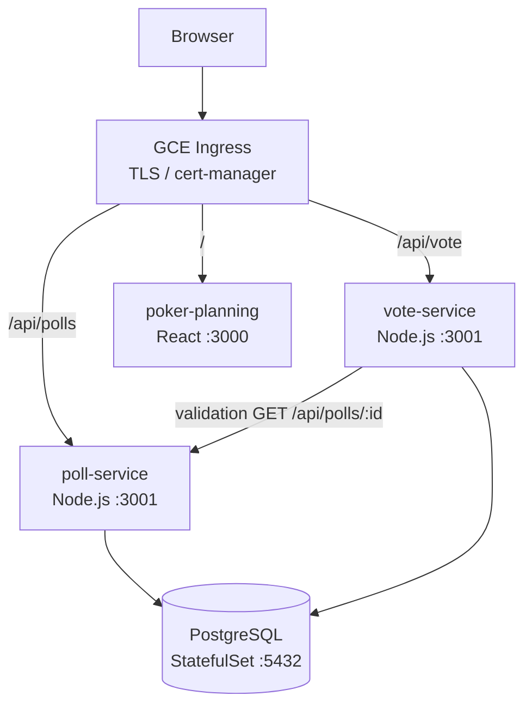
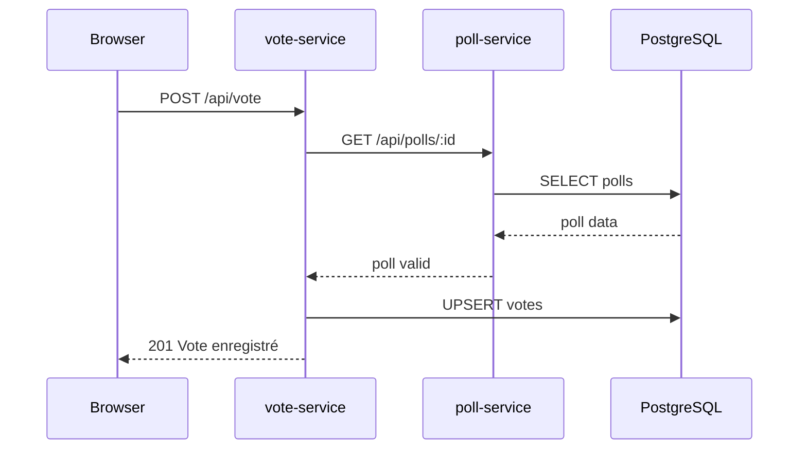
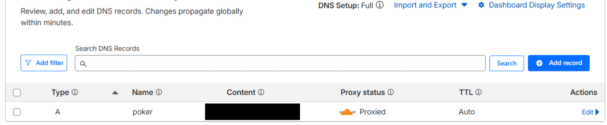
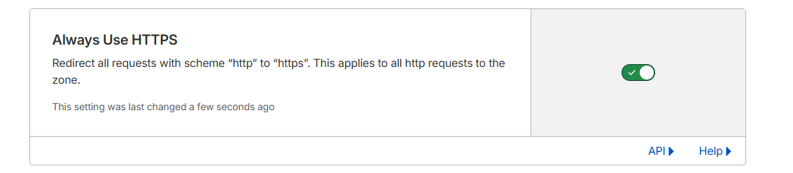
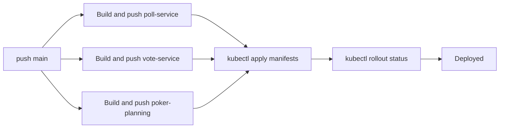

---
pdf_options:
  format: A4
  margin: 30mm 20mm
script:
  - url: https://unpkg.com/mermaid@9/dist/mermaid.min.js
  - content: |
      document.querySelectorAll('code.language-mermaid').forEach(el => {
        const div = document.createElement('div');
        div.className = 'mermaid';
        div.textContent = el.textContent;
        el.parentNode.replaceWith(div);
      });
      mermaid.initialize({ startOnLoad: false, securityLevel: 'loose' });
      mermaid.init(undefined, document.querySelectorAll('.mermaid'));
---

<style>
  h2, h3 {
    page-break-after: avoid;
  }
  h2 + p, h2 + ul, h2 + table, h2 + pre, h2 + blockquote,
  h3 + p, h3 + ul, h3 + table, h3 + pre, h3 + blockquote {
    page-break-before: avoid;
  }
</style>

<div style="display: flex; justify-content: space-between; align-items: center; margin-bottom: 40px; border-bottom: 2px solid #1a73e8;">
  
  <div style="text-align: right; font-family: sans-serif;">
    <div style="font-size: 1.1em; font-weight: 600; color: #1a1a1a;">Vincent Lam</div>
    <div style="font-size: 1.1em; font-weight: 600; color: #1a1a1a;">Mélissa Lacheb</div>
    <div style="font-size: 0.85em; color: #555; margin-top: 6px;">Intégration Cloud - 2025/2026</div>
  </div>
</div>

# Rapport de Projet - Intégration Cloud

**Application déployée** : https://poker.vincentlam.xyz/

**README** : https://github.com/lam-vincent/Cloud-integration#readme

**Dépôt GitHub** : https://github.com/lam-vincent/Cloud-integration

**Rapport dans le lecteur de github** : https://github.com/lam-vincent/Cloud-integration/blob/main/docs/report.md

---

> **Note de sécurité** : De nombreuses informations sensibles ont été volontairement omises ou remplacées dans ce rapport et dans le dépôt - identifiants Docker Hub, mots de passe, tokens d'API (Cloudflare, Google Cloud), adresses IP des services internes, noms de clusters, secrets Kubernetes, et chaînes de connexion à la base de données. L'application est exposée derrière un proxy Cloudflare qui masque l'infrastructure réelle. Tout ce à quoi j'étais capable de penser en termes de sécurité a été mis en place : secrets Kubernetes pour les credentials, TLS via cert-manager et Let's Encrypt, isolation réseau des services et politique d'accès minimale sur GCP.

---

## Table des matières

1. [Introduction](#1-introduction)
2. [Démonstrations](#démonstrations)
3. [Architecture](#2-architecture)
4. [Stack Technologique](#3-stack-technologique)
5. [Progression par Phase](#4-progression-par-phase)
   - [Phase 1 - Service unique (Minikube)](#phase-1---service-unique-déployé-localement-avec-minikube-1020)
   - [Phase 2 - Ingress](#phase-2---api-gateway--ingress-1220)
   - [Phase 3 - Second service](#phase-3---second-service--communication-inter-services-1420)
   - [Phase 4 - Base de données](#phase-4---intégration-base-de-données-1620)
   - [Phase 5 - Mise en production sur GKE (TLS, DNS, Cloudflare)](#phase-5---mise-en-production-sur-gke-tls-dns-cloudflare-1820)
   - [Phase 6 (Bonus) - CI/CD GitHub Actions](#phase-6-bonus---pipeline-cicd-github-actions-2020)
   - [Phase 7 (Bonus) - SSE remplaçant le polling HTTP](#phase-7-bonus---sse-remplaçant-le-polling-http-2020)
6. [Référence API](#5-référence-api)
7. [Schéma de Base de Données](#6-schéma-de-base-de-données)
8. [Manifests Kubernetes](#7-manifests-kubernetes)
9. [Dockerfiles](#8-dockerfiles)
10. [Configuration GCP / Cloudflare](#9-configuration-gcp--cloudflare)
11. [Problèmes rencontrés et Dépannage](#10-problèmes-rencontrés-et-dépannage)
12. [Google Labs](#11-google-labs)
13. [Conclusion](#12-conclusion)

---

## 1. Introduction

### Description de l'application

**Poker Planning App** est une application web de sondage en temps réel. Elle permet à des utilisateurs de :

- Créer des sondages avec plusieurs options de réponse
- Voter pour une option (un vote par utilisateur, modifiable)
- Visualiser les résultats en temps réel

L'application est structurée en microservices et déployée sur Kubernetes, d'abord localement avec Minikube, puis sur Google Kubernetes Engine (GKE) avec TLS.

### Équipe

| Membre         | Rôle                                                         |
| -------------- | ------------------------------------------------------------ |
| Vincent Lam    | Développement, déploiement K8s, configuration GCP/Cloudflare |
| Mélissa Lacheb | Développement, déploiement K8s                               |

---

## Démonstrations

Les vidéos de démonstration sont disponibles dans le dossier `docs/` du dépôt, et également accessibles directement depuis le [README.md](https://github.com/lam-vincent/Cloud-integration#Demo) (lecteur intégré).

| Vidéo                                                                                | Description                                    |
| ------------------------------------------------------------------------------------ | ---------------------------------------------- |
| `docs/create-new-session.mp4`                                                        | Création d'une session de planning poker       |
| `docs/change-name.mp4`                                                               | Changement de nom d'un participant             |
| `docs/replace-http-polling-with-server-sent-events-sse-postgresql-listen-notify.mp4` | Remplacement du polling HTTP par SSE (Phase 7) |

---

## 2. Architecture

### Vue d'ensemble



### Communication inter-services

Le `vote-service` appelle `poll-service` via le DNS interne Kubernetes (`http://poll-service/api/polls/:id`) pour valider qu'un sondage existe et que l'option choisie est valide avant d'enregistrer le vote.



---

## 3. Stack Technologique

| Technologie                | Usage                                         | Emplacement dans le code                                            |
| -------------------------- | --------------------------------------------- | ------------------------------------------------------------------- |
| **Node.js / Express**      | Backend REST API (poll-service, vote-service) | `live-poll-app/server.js`, `live-poll-app/vote-service/server.js`   |
| **React**                  | Frontend (interface utilisateur)              | `live-poll-app/client/`                                             |
| **PostgreSQL**             | Base de données persistante                   | `live-poll-app/postgres-deployment.yaml`                            |
| **Docker**                 | Conteneurisation des services                 | `live-poll-app/Dockerfile`, `live-poll-app/vote-service/Dockerfile` |
| **Kubernetes**             | Orchestration des conteneurs                  | `live-poll-app/*.yaml`                                              |
| **Minikube**               | Cluster K8s local (développement)             | -                                                                   |
| **GKE**                    | Cluster K8s cloud (production)                | -                                                                   |
| **GCE Ingress**            | Point d'entrée HTTP/HTTPS                     | `live-poll-app/poll-ingress.yaml`                                   |
| **cert-manager**           | Gestion automatique des certificats TLS       | `live-poll-app/clusterissuer.yaml`                                  |
| **Let's Encrypt**          | Autorité de certification (gratuite)          | `live-poll-app/clusterissuer.yaml`                                  |
| **Cloudflare**             | DNS + proxy CDN                               | `docs/Cloudflare + GCP Ingress SSL Setup/`                          |
| **axios**                  | Appels HTTP entre services                    | `live-poll-app/vote-service/server.js`                              |
| **concurrently / nodemon** | Dev tooling                                   | `live-poll-app/package.json`                                        |
| **GitHub Actions**         | CI/CD pipeline (build, push, deploy sur GKE)  | `.github/workflows/deploy.yml`                                      |

---

## 4. Progression par Phase

### Phase 1 - Service unique déployé localement avec Minikube (10/20)

**Objectif** : Déployer un premier service Node.js dans un cluster Kubernetes local.

**Ce qui a été fait** :

- Création de `poll-service` (Express, endpoint `GET /api/polls`)
- Écriture du `Dockerfile`
- Build de l'image Docker et push vers Docker Hub
- Déploiement avec `kubectl` et exposition via NodePort

**Commandes utilisées** :

```bash
minikube start
docker build -t poll-service .
docker tag poll-service <dockerhub-user>/poll-service:1
docker push <dockerhub-user>/poll-service:1
kubectl apply -f poll-deployment.yaml
kubectl apply -f poll-service.yaml
minikube service poll-service --url
```

**Vérification** :

```bash
kubectl get pods
kubectl get services
```

---

### Phase 2 - API Gateway / Ingress (12/20)

**Objectif** : Exposer les services via un Ingress centralisé.

**Ce qui a été fait** :

- Activation du contrôleur Ingress NGINX dans Minikube
- Création de `poll-ingress.yaml` avec règles de routage par chemin
- Test local via modification du fichier `/etc/hosts`
- Migration vers GCE Ingress pour le déploiement cloud

**Commandes utilisées** :

```bash
# Minikube local
minikube addons enable ingress
kubectl apply -f poll-ingress.yaml
kubectl get ingress

# Tunnel Minikube
minikube tunnel
```

**Extrait du manifest Ingress** :

```yaml
rules:
  - host: <votre-domaine>
    http:
      paths:
        - path: /api/polls
          pathType: Prefix
          backend:
            service:
              name: poll-service
              port:
                number: 80
```

---

### Phase 3 - Second service + communication inter-services (14/20)

**Objectif** : Ajouter un second microservice qui communique avec le premier.

**Ce qui a été fait** :

- Création de `vote-service` (Express, endpoint `POST /api/vote`)
- Implémentation de la validation cross-service : `vote-service` appelle `poll-service` via DNS interne K8s
- Déploiement de `vote-deployment.yaml` et `vote-service.yaml`
- Ajout de la route `/api/vote` dans l'Ingress

**Communication inter-services** :

```javascript
// vote-service/server.js
const POLL_SERVICE_URL = "http://poll-service/api/polls";
const response = await axios.get(`${POLL_SERVICE_URL}/${pollId}`);
```

Le DNS Kubernetes résout `poll-service` vers le ClusterIP du service correspondant.

---

### Phase 4 - Intégration base de données (16/20)

**Objectif** : Persister les données dans une base de données relationnelle.

**Ce qui a été fait** :

- Déploiement de PostgreSQL en tant que StatefulSet (avec `volumeClaimTemplates` pour la persistance)
- Création du secret Kubernetes pour le mot de passe
- Initialisation automatique du schéma au démarrage des services (`initDB()`)
- Ajout de la contrainte UNIQUE `(poll_id, username)` pour empêcher les votes multiples

**Prérequis** :

```bash
kubectl create secret generic postgres-secret \
  --from-literal=POSTGRES_PASSWORD=<votre-mot-de-passe>
```

**Déploiement** :

```bash
kubectl apply -f postgres-deployment.yaml
```

**Schéma SQL initialisé automatiquement** :

```sql
CREATE TABLE IF NOT EXISTS polls (
  id SERIAL PRIMARY KEY,
  question TEXT NOT NULL,
  options TEXT[] NOT NULL
);

CREATE TABLE IF NOT EXISTS votes (
  id SERIAL PRIMARY KEY,
  poll_id INTEGER,
  selected_option TEXT NOT NULL,
  username TEXT NOT NULL,
  voted_at TIMESTAMP DEFAULT NOW()
);

CREATE UNIQUE INDEX IF NOT EXISTS votes_poll_id_username_idx
  ON votes(poll_id, username);
```

---

### Phase 5 - Mise en production sur GKE (TLS, DNS, Cloudflare) (18/20)

**Objectif** : Déployer sur GKE avec un domaine personnalisé et HTTPS.

**Ce qui a été fait** :

- Création d'un cluster GKE via Google Cloud Console
- Push des images vers Google Artifact Registry
- Configuration de cert-manager avec ClusterIssuer Let's Encrypt (DNS-01 via Cloudflare)
- Configuration du DNS Cloudflare pour pointer vers l'IP de l'Ingress GCE
- Mise à jour de `poll-ingress.yaml` avec TLS et annotation cert-manager

**Commandes GKE** :

```bash
gcloud container clusters get-credentials <cluster-name> --zone <zone>
kubectl apply -f clusterissuer.yaml
kubectl apply -f poll-ingress.yaml
kubectl get ingress   # Récupérer l'IP externe
```

**Extrait TLS dans l'Ingress** :

```yaml
annotations:
  cert-manager.io/cluster-issuer: letsencrypt-prod
  kubernetes.io/ingress.class: gce
spec:
  tls:
    - hosts:
        - <votre-domaine>
      secretName: poker-tls
```

**Vérification** :

<div style="display: flex; gap: 16px; align-items: flex-start;">
  
  
</div>

**Configurations Cloudflare** :


<div style="display: flex; gap: 16px; align-items: flex-start; margin-top: 16px;">
  
  
</div>

---

### Phase 6 (Bonus) - Pipeline CI/CD GitHub Actions (20/20)

**Objectif** : Automatiser le build, le push des images et le déploiement sur GKE à chaque push sur `main`.

**Ce qui a été fait** :

- Création de `.github/workflows/deploy.yml`
- Authentification GCP via Workload Identity Federation (sans clé de service)
- Build et push des 3 images vers Artifact Registry avec deux tags : `:latest` et `:<sha>`
- Application des manifests Kubernetes via `envsubst` + `kubectl apply`
- Attente du rollout avec `kubectl rollout status`

**Pipeline** :



**Variables d'environnement injectées via `envsubst`** :

| Variable              | Valeur                       |
| --------------------- | ---------------------------- |
| `YOUR_REGISTRY_HOST`  | `REGION-docker.pkg.dev`      |
| `YOUR_GCP_PROJECT_ID` | ID du projet GCP             |
| `YOUR_DOMAIN`         | `poker.vincentlam.xyz`       |
| `SHA`                 | SHA du commit (`github.sha`) |

---

### Phase 7 (Bonus) - SSE remplaçant le polling HTTP (20/20)

**Objectif** : Remplacer le polling HTTP côté client par des Server-Sent Events (SSE) pour la mise à jour en temps réel des résultats.

**Ce qui a été fait** :

- Implémentation d'un endpoint SSE `GET /api/polls/:id/votes/stream`
- Utilisation de PostgreSQL LISTEN/NOTIFY pour pousser les mises à jour depuis la base de données
- Remplacement du `setInterval` côté React par un `EventSource`

**Démonstration** : voir section [Démonstrations](#démonstrations) - `docs/replace-http-polling-with-server-sent-events-sse-postgresql-listen-notify.mp4`

---

## 5. Référence API

### poll-service

| Méthode | Route                         | Corps                   | Réponse                                   |
| ------- | ----------------------------- | ----------------------- | ----------------------------------------- |
| `GET`   | `/api/polls`                  | -                       | `[{id, question, options}]`               |
| `POST`  | `/api/polls`                  | `{question, options[]}` | `{id, question, options}` (201)           |
| `GET`   | `/api/polls/:id`              | -                       | `{id, question, options}` ou 404          |
| `GET`   | `/api/polls/:id/votes`        | -                       | `[{username, selected_option, voted_at}]` |
| `GET`   | `/api/polls/:id/votes/stream` | -                       | SSE stream                                |

**Exemple POST /api/polls** :

```json
{
  "question": "Fix 500 Error on GET /api/polls #17",
  "options": ["1", "2", "3", "5", "8", "13", "21", "?"]
}
```

### vote-service

| Méthode | Route       | Corps                        | Réponse                      |
| ------- | ----------- | ---------------------------- | ---------------------------- |
| `POST`  | `/api/vote` | `{pollId, option, username}` | `{message}` (201) ou 400/404 |

**Exemple POST /api/vote** :

```json
{
  "pollId": 1,
  "option": "8",
  "username": "mélissa"
}
```

**Comportement upsert** : si l'utilisateur a déjà voté pour ce sondage, son vote est mis à jour.

---

## 6. Schéma de Base de Données

### Table `polls` (gérée par poll-service)

| Colonne    | Type   | Contrainte  | Description                   |
| ---------- | ------ | ----------- | ----------------------------- |
| `id`       | SERIAL | PRIMARY KEY | Identifiant auto-incrémenté   |
| `question` | TEXT   | NOT NULL    | Texte de la question          |
| `options`  | TEXT[] | NOT NULL    | Tableau des options possibles |

### Table `votes` (gérée par vote-service)

| Colonne           | Type      | Contrainte    | Description                 |
| ----------------- | --------- | ------------- | --------------------------- |
| `id`              | SERIAL    | PRIMARY KEY   | Identifiant auto-incrémenté |
| `poll_id`         | INTEGER   | -             | Référence vers le sondage   |
| `selected_option` | TEXT      | NOT NULL      | Option choisie              |
| `username`        | TEXT      | NOT NULL      | Nom de l'utilisateur        |
| `voted_at`        | TIMESTAMP | DEFAULT NOW() | Horodatage du vote          |

**Index unique** : `UNIQUE(poll_id, username)` - garantit un seul vote par utilisateur par sondage.

---

## 7. Manifests Kubernetes

| Fichier                          | Type                  | Description                                                        |
| -------------------------------- | --------------------- | ------------------------------------------------------------------ |
| `poll-deployment.yaml`           | Deployment            | Déploie poll-service (2 réplicas, imagePullPolicy: Always, probes) |
| `poll-service.yaml`              | Service (ClusterIP)   | Expose poll-service en interne sur le port 80 (→ 3001)             |
| `vote-deployment.yaml`           | Deployment            | Déploie vote-service (imagePullPolicy: Always, probes)             |
| `vote-service.yaml`              | Service (ClusterIP)   | Expose vote-service en interne sur le port 80 (→ 3001)             |
| `postgres-deployment.yaml`       | StatefulSet + Service | PostgreSQL avec stockage persistant via volumeClaimTemplates       |
| `poll-ingress.yaml`              | Ingress               | Routage HTTP/HTTPS, TLS via cert-manager, GCE class                |
| `clusterissuer.yaml`             | ClusterIssuer         | Configuration Let's Encrypt (DNS-01 Cloudflare)                    |
| `backend-config.yaml`            | BackendConfig         | Configuration des health checks GKE                                |
| `poker-planning-deployment.yaml` | Deployment + Service  | Frontend React (poker planning)                                    |
| `postgres-pvc.yaml`              | _(obsolète)_          | Remplacé par volumeClaimTemplates dans le StatefulSet              |

### Note sur les tags d'image et `imagePullPolicy`

Les images sont taguées avec le SHA du commit (`:<sha>`) via la variable `$SHA` injectée par `envsubst`. Cela garantit que chaque déploiement modifie la spec du Deployment, forçant Kubernetes à redémarrer les pods avec la nouvelle image. `imagePullPolicy: Always` est conservé en complément.

---

## 8. Dockerfiles

### poll-service (`live-poll-app/Dockerfile`)

- Image de base : `node:alpine`
- Copie `package.json` et installe les dépendances
- Copie le code source
- Expose le port 3001
- Commande : `node server.js`

### vote-service (`live-poll-app/vote-service/Dockerfile`)

- Structure identique à poll-service
- Expose le port 3001
- Commande : `node server.js`

### Build et push vers Artifact Registry

```bash
docker build -t REGION-docker.pkg.dev/PROJECT_ID/REPO/poll-service:latest .
docker push REGION-docker.pkg.dev/PROJECT_ID/REPO/poll-service:latest

docker build -t REGION-docker.pkg.dev/PROJECT_ID/REPO/vote-service:latest ./vote-service
docker push REGION-docker.pkg.dev/PROJECT_ID/REPO/vote-service:latest
```

---

## 9. Configuration GCP / Cloudflare

### Étapes GCP

1. Créer un projet GCP et activer les APIs (GKE, Artifact Registry)
2. Créer un cluster GKE
3. Créer un dépôt Artifact Registry
4. Installer et configurer `gcloud` CLI :
   ```bash
   gcloud auth configure-docker REGION-docker.pkg.dev
   gcloud container clusters get-credentials CLUSTER_NAME --zone ZONE
   ```
5. Installer cert-manager dans le cluster :
   ```bash
   kubectl apply -f https://github.com/cert-manager/cert-manager/releases/download/vX.X.X/cert-manager.yaml
   ```
6. Appliquer le ClusterIssuer et les manifests

### Monitoring du trafic (Cloudflare Analytics)

Cloudflare fournit des métriques de trafic en temps réel sans instrumentation supplémentaire.

<div style="display: flex; gap: 16px; align-items: flex-start;">
  <div style="flex: 1;">
    <p><strong>24 heures</strong></p>
    
  </div>
  <div style="flex: 1;">
    <p><strong>7 jours</strong></p>
    
  </div>
</div>

---

### Étapes Cloudflare

1. Ajouter le domaine dans Cloudflare
2. Mettre à jour les nameservers chez le registrar
3. Créer un enregistrement DNS `A` pointant vers l'IP externe de l'Ingress GCE
4. Obtenir un token API Cloudflare pour le challenge DNS-01 de cert-manager
5. Créer un secret Kubernetes avec le token :
   ```bash
   kubectl create secret generic cloudflare-api-token-secret \
     --from-literal=api-token=<token>
   ```

---

## 10. Problèmes rencontrés et Dépannage

### GKE Backends UNHEALTHY

**Symptôme** : L'Ingress GCE marque les backends comme UNHEALTHY, les requêtes retournent 502.

**Cause** : Les health checks GCE vérifient le port du conteneur sur la route `/`. Si le service ne répond pas 200 sur `/`, le backend est considéré hors service.

**Solution** :

- Ajouter `GET /` retournant 200 dans chaque service
- Configurer `readinessProbe` et `livenessProbe` dans les Deployments
- Utiliser `BackendConfig` pour personnaliser les health checks

### Image non mise à jour après redéploiement

**Symptôme** : Après un `docker push` et `kubectl rollout restart`, les pods continuent d'utiliser l'ancienne image.

**Cause** : `imagePullPolicy` par défaut est `IfNotPresent` pour les tags non-latest. Avec `:latest` et `imagePullPolicy: Always`, Kubernetes re-pull mais ne redémarre les pods que si la spec du Deployment change — ce qui n'arrive pas si le tag reste `:latest`.

**Solution** : Taguer les images avec le SHA du commit (`:<sha>`) et injecter `SHA` via `envsubst` dans les manifests. Chaque déploiement produit une spec différente, forçant le rollout.

### Noms de deployments incorrects dans `kubectl rollout status`

**Symptôme** : `Error from server (NotFound): deployments.apps "poll-deployment" not found`

**Cause** : Le nom utilisé dans `kubectl rollout status deployment/<name>` ne correspondait pas au `metadata.name` dans les fichiers YAML (`poll-service-deployment` et `vote-service-deployment`).

**Solution** : Aligner les noms dans le workflow avec les `metadata.name` réels des manifests.

---

## 11. Google Labs

If the links fail to work, the screenshots can also be found in the docs/ folder.

<div style="display: flex; gap: 16px; align-items: flex-start; page-break-inside: avoid;">
  <div style="flex: 1;">
    <p><strong>Vincent LAM</strong></p>
    
  </div>
  <div style="flex: 1;">
    <p><strong>Mélissa LACHEB</strong></p>
    
  </div>
</div>

---

## 12. Conclusion

### Ce que nous avons appris

- **Kubernetes** : déploiement de microservices, services ClusterIP, Ingress, StatefulSets, secrets, probes
- **Docker** : conteneurisation d'applications Node.js, gestion du registre d'images
- **GKE** : spécificités du cloud (GCE Ingress, health checks, Artifact Registry)
- **TLS / cert-manager** : automatisation des certificats Let's Encrypt avec challenge DNS-01
- **Architecture microservices** : communication inter-services, validation distribuée
- **PostgreSQL sur K8s** : persistance avec StatefulSet et volumeClaimTemplates
- **CI/CD** : pipeline GitHub Actions avec Workload Identity Federation, envsubst, et rollout automatisé
